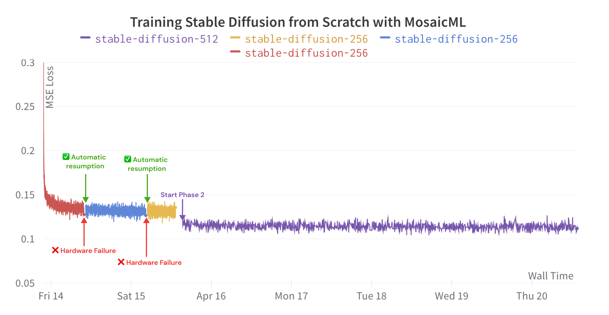

<h2><p align="center">Stable Diffusion Training with MosaicML</p></h2>

<p align="center">
    <a href="https://join.slack.com/t/mosaicml-community/shared_invite/zt-w0tiddn9-WGTlRpfjcO9J5jyrMub1dg">
        
    </a>
    <a href="https://github.com/mosaicml/examples/blob/main/LICENSE">
        
    </a>
</p>
<br />


This repo contains code used to train your own Stable Diffusion model on your own data.

<p align="center">
  <picture>
    
  </picture>
</p>

<p align="center">
  <picture>
    
  </picture>
</p>

> Results from our Mosaic Diffusion model after training for 550k iterations at 256x256 resolution, then for 850k iterations at 512x512.

<p align="center">
  <picture>
    
  </picture>
</p>

# Prerequisites

Here are the system settings we recommend to start training your own diffusion models:

- Use a Docker image with PyTorch 1.13+, e.g. [MosaicML's PyTorch base image](https://hub.docker.com/r/mosaicml/pytorch/tags)
  - Recommended tag: `mosaicml/pytorch_vision:1.13.1_cu117-python3.10-ubuntu20.04`
  - This image comes pre-configured with the following dependencies:
    - PyTorch Version: 1.13.1
    - CUDA Version: 11.7
    - Python Version: 3.10
    - Ubuntu Version: 20.04
- Use a system with NVIDIA GPUs

# How many GPUs do I need?

We benchmarked the U-Net training throughput as we scale the number of A100 GPUs from 8 to 128. Our time estimates are based on training Stable Diffusion 2.0 base on 1,126,400,000 images at 256x256 resolution and 1,740,800,000 images at 512x512 resolution. Our cost estimates are based on $2 / A100-hour. Since the time and cost estimates are for the U-Net only, these only hold if the VAE and CLIP latents are computed before training. It took 3,784 A100-hours (cost of $7,600) to pre-compute the VAE and CLIP latents offline. If you are computing VAE and CLIP latents while training, expect a 1.4x increase in time and cost.

| Number of A100s | Throughput for UNet @ 256x256 (images / second) | Throughput for UNet @ 512x512 (images / second) | Days to Train on MosaicML Cloud | Approx. Cost on MosaicML Cloud |
|:---------------:|:-----------------------------------------------:|:-----------------------------------------------:|:-------------------------------:|:------------------------------:|
|        8        |                       1100                      |                       290                       |              81.33              |             $31,230            |
|        16       |                       2180                      |                       585                       |              40.42              |             $31,043            |
|        32       |                       4080                      |                       1195                      |              20.06              |             $30,805            |
|        64       |                       8530                      |                       2340                      |              10.14              |             $31,146            |
|       128       |                      11600                      |                       4590                      |               5.51              |             $33,874            |

# Clone the repo and install requirements

```
git clone https://github.com/mosaicml/diffusion.git
cd diffusion
pip install -e .
```

# Data Prep

If you are interested in training on LAION-5B or evaluating on COCO Captions, we provide [scripts](https://github.com/mosaicml/diffusion2/tree/main/scripts) to download and process these datasets into Streaming datasets.

Alternatively, you can use your own image-caption dataset(s) as long as samples are returned as a dictionary from a PyTorch Dataset class. To use a custom dataset with our configurations, define a function that returns a PyTorch DataLoader for the custom dataset (for an example, see [`build_streaming_laion_dataloader()`](https://github.com/mosaicml/diffusion2/blob/34e95ef50836581fab1bec3effaed8fa9d0ae464/diffusion/datasets/laion/laion.py#L115)). The best way to add custom code is to fork this repo, then add the python scripts to `diffusion/datasets`.

# Adjust config

The configurations for the two phases of training are specified at [`SD-2-base-256.yaml`](https://github.com/mosaicml/diffusion2/blob/main/yamls/hydra-yamls/SD-2-base-256.yaml) and [`SD-2-base-512.yaml`](https://github.com/mosaicml/diffusion2/blob/main/yamls/hydra-yamls/SD-2-base-512.yaml). A few fields are left blank that need to be filled in to start training. The `dataset` field is the primary field to change. If you downloaded and converted the LAION-5B dataset into your own Streaming dataset, change the `remote` field under `train_dataset` to the bucket containing your streaming LAION-5B. Similarly for COCO validation, change the `remote` field under `eval_dataset` to the bucket containing your streaming COCO.

If you opted to use your own datasets, change the `_target_` field under both `train_dataset` and `eval_dataset` to contain the absolute path to the function that returns the PyTorch DataLoader for your dataset. Replace the fields after `_target_` with the arguments for your function.

If you have not pre-computed the VAE and CLIP latents for your dataset, set `precomputed_latents` field to `false`.

## Train the model

Once the configurations have been updated, start training at 256x256 resolution by running:
```
composer run.py --config_path yamls/hydra-yamls --config_name SD-2-base-256.yaml
```
Next, start training at 512x512 resolution by running:
```
composer run.py --config_path yamls/hydra-yamls --config_name SD-2-base-512.yaml
```

# Online Eval
Our code is able to calculate the FID score at several guidance scales while training. To use this feature, add the torchmetrics class `FrechetInceptionDistance` to the `val_metrics` field and specify your desired guidance scores at the `val_guidance_scales` field under `model`. Below is an example config for calculating FID score online for guidance scores [1, 3, 7]:
```
model:
  _target_: diffusion.models.models.stable_diffusion_2
  pretrained: false
  precomputed_latents: false
  encode_latents_in_fp16: true
  fsdp: true
  val_metrics:
    - _target_: torchmetrics.MeanSquaredError
    - _target_: torchmetrics.image.fid.FrechetInceptionDistance
      normalize: true
  val_guidance_scales: [1, 3, 7]
  loss_bins: []
```
Computing FID during training can be slow due to the number of images that must be generated, and it requires extra device memory. Caution should be used when using online eval if device memory or runtime is a concern.

You can also log generated images to Weights and Biases throughout training to qualitatively measure model performance. This is done by specifying the `LogDiffusionImages` callback class under `callbacks` in a configuration file like so:
```
  image_monitor:
    _target_: diffusion.callbacks.log_diffusion_images.LogDiffusionImages
    prompts: # add any prompts you would like to visualize
    - A dog wearing a spacesuit
    - An astronaut riding a horse
    size: 256 # generated image resolution
    guidance_scale: 3
```

# Offline Eval
We also provide an offline evaluation script to compute FID and CLIP metrics on a saved checkpoint and the COCO dataset. To use this, run:
```
composer scripts/fid-clip-evaluation.py --guidance_scale 3.0 --remote YOUR_DATASET_PATH_HERE --load_path YOUR_CHECKPOINT_PATH_HERE
```
This will compute FID and CLIP score at a guidance scale of 3.0 using the image+prompts pairs. One can also set the seed used for image generation via `--seed 42` and the resolution to use for images via `--size 512`. Results can also be logged to Weights and Biases by setting the `--wandb` flag and specifying the `--project` and `--name`.

# Contact Us
If you run into any problems with the code, please file Github issues directly to this repo.
If you want to work with us directly, please reach out to us at demo@mosaicml.com!
